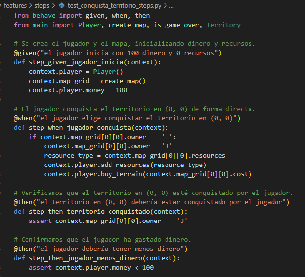
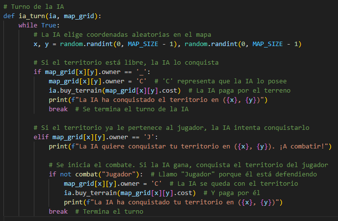
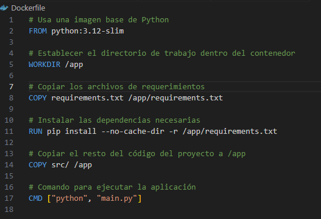
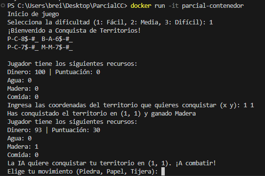

### KANBAN 

Se definieron 6 historias de usuario


Con el siguiente formato usando gherkin 


### Configuración de branches


### Observación 

Para el uso de pytest se presentaron problemas con la importación de modulos, por ese motivo todas las clases se encuentran en la carpeta main.py para evitar esos problemas.

## Creación de mapa (branch feature/mapa)

Nuestro juego tendrá 3 tipos de zonas (Pradera, Bosque, Montaña) y 3 tipos de recompensas (Agua, Madera, Comida)

Según la historia de usuario definida en el kanban necesitamos que se cree el mapa aleatoriamente indicando la zona y los recursos correspondiente

Por defecto, el terreno no tiene dueño. Por ese motivo se indicará como sin reclamar -> "_" Jugador -> "J" Computadora -> "C"


#### Pruebas unitarias

```python
test.territorio
```


```python
test.mapa
```


```python
Ejecución
```

#### BDD

```python
steps
```
Para el desarrollo guiado comportamiento usaremos behave


```python
feature
```


```python
Ejecución
```


#### CI/CD

El archivo main.yml se configura para establecer un pipeline automatizado que facilita la integración continua (CI) y la entrega continua (CD). Este pipeline tiene como objetivo mejorar la calidad del desarrollo y la eficiencia del despliegue al automatizar tareas clave durante el ciclo de vida del proyecto.


- Con dependencias 


- Ejecución


### Actualización kanban 


## Sistema de recolección de recursos y conquista (branch feature/recursos-expansion)

Cada usuario deberá contar con dinero para poder comprar el territorio

Cada usuario gastará dinero para obtener el territorio y obtendrá los recursos de este mismo

- Cambios en el código


- Turno del jugador

Necesitamos que el jugador pueda jugar por turnos 


Necesitamos que el juego acabe cuando ya no queden territorios por conquistar


- Bucle principal


```python
Ejecución
```


#### Pruebas unitarias

Debido a que se añadió la clase Player y la lógica del turno del jugador se definen nuevos test


```python
Ejecución
```


### BDD

```python
Feature: Conquista de territorio
```


```python
test_conquista_territorio_steps.py
```

La acción when para "el jugador elige conquista el territorio"
se selecciona la casilla automaticamente, evitando tener que ingresar manualmente las coordenadas





```python
Ejecución
```


```python
CI/CD Pipeline
```


### Actualización kanban 


## Sistema de combate y ia (branch feature/combate-ia)

Vamos a definir la clase de la ia, para que también pueda gastar dinero


La ia jugará su turno luego que nosotros e intentará conquistar una tierra disponible



Por otro lado, cuando se intente conquistar un territorio enemigo se decidirá quien lo obtiene mediante piedra, papel o tijera


- Actualizamos el flujo del programa


### Test

En los siguientes tests se usará mocker, una herramienta que nos permite simular el comportamiento de funciones en nuestros tests, por ejemplo simular el ingreso de datos por consola.

Se define un test para los combates por el territorio


Tests para inicializacion de clases 


Tests para comprar y obtención de recursos 


### BDD

Se actualiza el feature de conquista de territorios

Ahora en el contexto de combates, analizamos el compartamiento para las caracteristicas añadidas


Steps escenario 1


Steps escenario 2


Steps escenario 3


### Actualización de pipeline 

Como se añadió mocker necesitamos agregarlo en el pipeline


```python
Ejecución
```


   

### Actualización kanban 


## Sistema de puntuacion y dificultad (branch feature/puntuacion-dificultad)

Para este caso, el sistema de puntucación funciona así:

- 10 puntos por recurso obtenido
- 20 puntos por territorio conquistado

El sistema de dificultad tiene la siguientes caracteristicas:

Tamaño base 2 x 2

Cada nivel tiene un tamaño de tamaño_base * nivel 

Cada territorio va a costar desde random(5,10) * nivel

#### Cambios en el código

- Sistema de puntaje 

Player e IA comparten estas caracterisiticas y al ser IA practicamente una Herencia de Player se hizo lo siguiente: 


Configuración de puntajes


Conteo de puntos 


- Sistema de dificultad 

Tamaño de mapa = tamaño base * nivel


Costo de compra random(5,10) * nivel


#### REGEX 

- Validación de combate 

Solo podemos elegir piedra, papel o tijera


- Validación de coordenadas

Las coordenadas solo serán numéricas y separadas por un espacio


- Validación de dificultad

La dificultad solo podrá ser un número entre 1 y 3


#### Test 

Luego de agregar esas validaciones al código se crearon los siguientes tests 


#### BDD 

Se agregó lo siguiente en test_dificultad_puntaje.feature 


- Escenario 1


- Escenario 2


- Escenario 3


### Ejecución 

- CI / CD


- Consola


- Puntaje 


### Actualización kanban 


## Rama Develop

Ahora vamos a juntar el proyecto en la rama develop para empezar a **contenerizar** el proyecto y darle metricas en **graphana**y **prometheus**

- Dockerfile



- Construcción de imagen 


- Ejecución de contenedor



- Vista en docker desktop 


## Graphana y prometheus

Para las gráficas añadimos métricas


Tal que cada vez que se agreguen recursos se monitoree


- docker-compose

Usamos docker-compose para correr diferentes servicios en nuestro contenedor, indicando su puerto correspondiente


- prometheus.yml

Usamos este archivo para poder obtener desde el puerto de la app las métricas y prometheus pueda leerlas


- Ejecución

Sucede un error, debido a que se tiene que ingresar datos por consola, el flujo de la aplicación se interrumpe


### Kanban final 

Finalmente, queda en revisión el uso de métricas con prometheus y graphana

